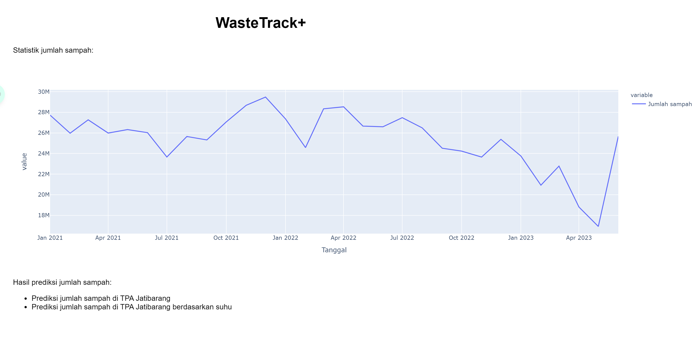
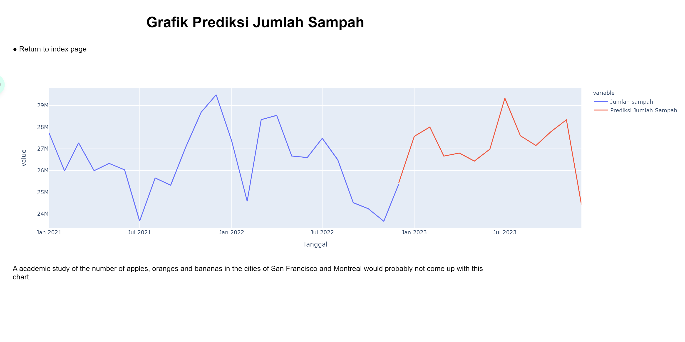

# WasteTrack-Time-Series-API

The WasteTrack Time-Series API project is a web application developed to track and visualize waste production over time. It uses Flask, a Python web framework, to build the backend server and provides a user-friendly interface to interact with the waste data.

## 📷 Screenshot



## ✨ Prerequisites

- Python 3.x
- Flask
- Plotly
- Pandas

## 🤖 Installation

1. Clone the repository:
   ```shell
   git clone https://github.com/bimarakajati/WasteTrack-Time-Series-API.git
   ```

2. Install the required dependencies:
    ```shell
    pip install -r requirements.txt
    ```

## 💁‍ Usage

1. Run the Flask app:
   ```shell
   python main.py
   ```
2. Open your web browser and navigate to http://localhost:5000 to access the web interface.

## ✨ Author

|             Name            |      NIM       |       Job Desk       |
| --------------------------- | -------------- |----------------------|
| Bima Rakajati               | A11.2020.13088 | Time Series          |

## 📙 Reference

Thanks to their great works：
- https://github.com/alanjones2/Flask-Plotly